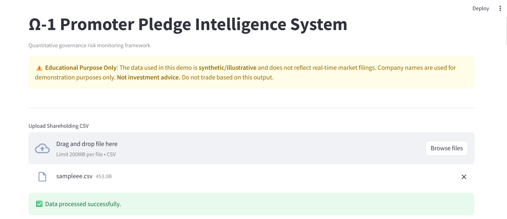
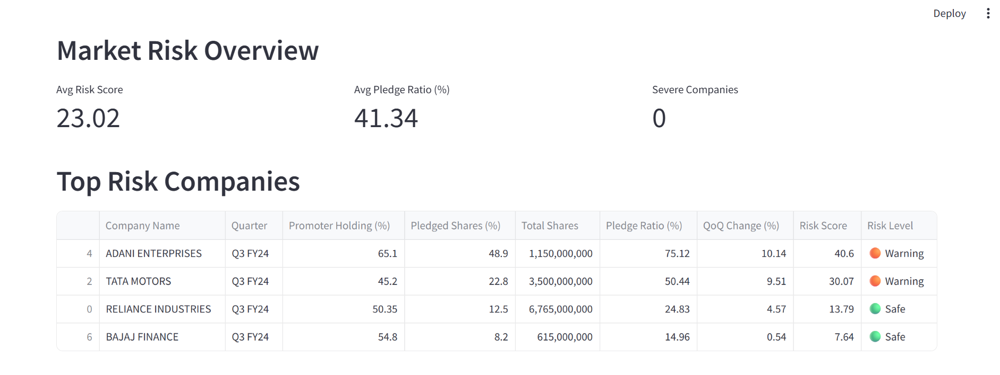
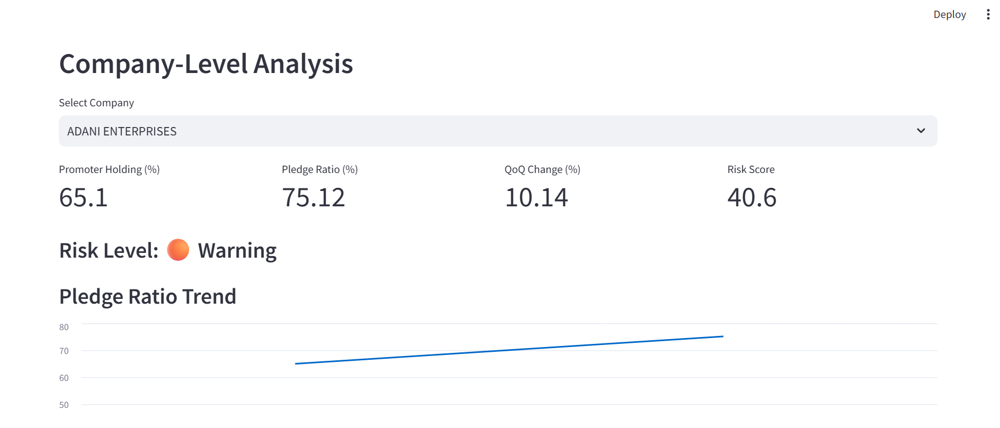

> # Ω-1 Promoter Pledge Intelligence System

> [](https://omega-promoter-pledge-intelligence-system-326nbvafazfrcdfskqjc.streamlit.app)

> **🌐 Live Demo**: [Try the Ω-1 Pledge Tracker Here](https://omega-promoter-pledge-intelligence-system-326nbvafazfrcdfskqjc.streamlit.app)

> ⚠️ **DISCLAIMER: Educational Purpose Only**  
> - **Data**: The dataset included (`sample_data.csv`) contains **synthetic/illustrative data** using real company names for demonstration purposes only.  
> - **Accuracy**: Values do not reflect actual SEBI/BSE filings or real-time market conditions.  
> - **Usage**: This tool is for **learning and portfolio demonstration** only. It is **NOT investment advice**.  
> - **Liability**: Do not make trading or investment decisions based on this prototype.

---

## Overview

The Ω-1 Promoter Pledge Intelligence System is a quantitative governance risk monitoring framework designed to assess promoter pledge risk across Indian listed companies.

This system evaluates pledge intensity, acceleration risk, and promoter ownership strength using a structured weighted scoring model.

---

## Problem Statement

Promoter pledging of shares can signal financial stress and governance risk. 

High pledge ratios, rapid increases in pledging, and low promoter holding can significantly amplify downside risk for minority shareholders.

This framework converts these governance indicators into a structured, trackable risk score.

---

## Core Risk Model

The model evaluates:

1. **Pledge Ratio (%)**
   - Pledged Shares ÷ Promoter Holding

2. **Quarter-over-Quarter Change (%)**
   - Measures acceleration in pledge intensity

3. **Promoter Holding Penalty**
   - Additional penalty applied when promoter holding falls below:
     - 50%
     - 40%

### Risk Score Formula

Risk Score =  
0.5 × Pledge Ratio  
+ 0.3 × QoQ Change  
+ 0.2 × Holding Penalty  

Companies are classified as:

- 🔴 Severe Risk  
- 🟠 Warning  
- 🟢 Safe  

---

## Features

- Automated pledge ratio computation
- Quarter-over-quarter acceleration detection
- Weighted governance risk scoring
- Risk classification framework
- Market-level risk overview dashboard
- Company-level deep dive analysis
- Pledge trend visualization

---

## 📸 Dashboard Preview

### Market Risk Overview


### Top Risk Companies


### Company-Level Analysis


---

## Tech Stack

- Python
- Pandas
- Streamlit
- Matplotlib

---

## How to Run

1. Clone the repository
2. Install dependencies:

```
pip install -r requirements.txt
```

3. Run the application:

```
streamlit run app.py
```

4. Upload a properly structured CSV file with:

- Company Name
- Quarter
- Promoter Holding (%)
- Pledged Shares (%)

- 

---

## Project Intent

This project was built to explore quantitative approaches to governance risk monitoring and financial risk analytics using structured financial data.

- Part of Ω-1 Sovereign Engine research initiative
- Built by Shivam Gupta

It demonstrates the application of financial logic, risk modeling, and dashboard-based analytics in a scalable framework.
